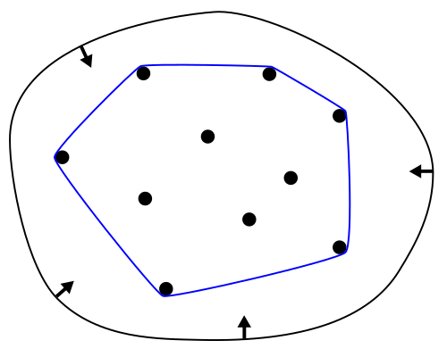

# Problem : 2D Convex Hull

## Description
Given a set of points in 2D space, *S*, find a subset of points *H* such that 
*H* is the (unique) minimal **convex** set containing *S*

A set is **convex** if  it is a set of points where a straight line connecting any two points in the set lies
completely within the boundary

## Example 

From: [Wikipedia](https://en.wikipedia.org/wiki/Convex_hull)

The points on the blue perimeter represent the Convex Hull set *H*

