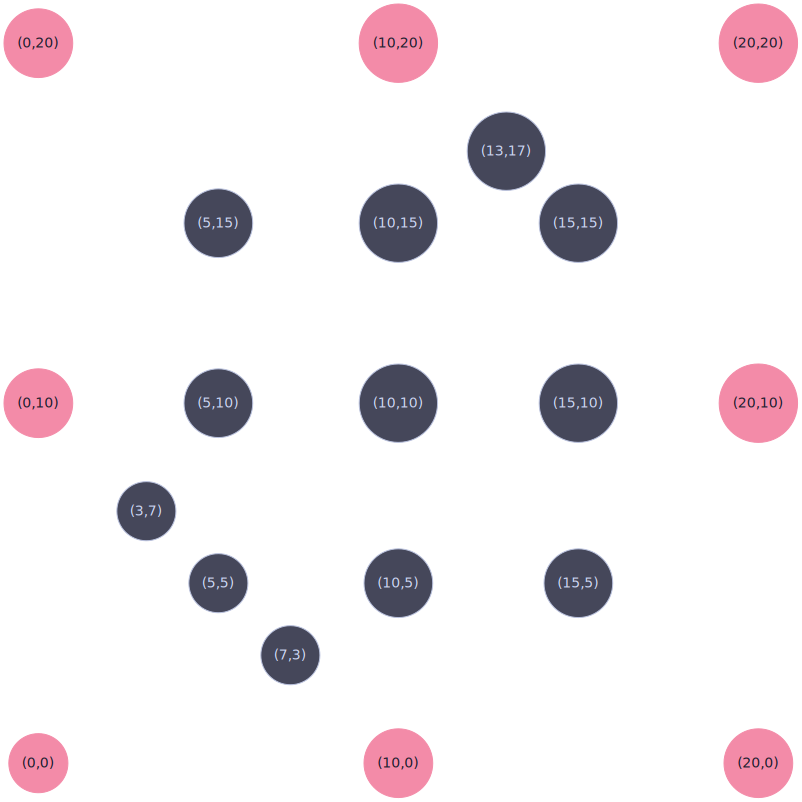

# Convex Hull Printer

## Description

The printer takes input from stdin, and can be piped directly in from the program's output in Clingo.
It can also read from a file using the -f flag

## Arguments

-f : relative path to the output of clingo on a Convex Hull problem


## Sample Output

```

//
strict graph {
    layout=neato
    node [shape=circle, style=filled, fillcolor="#45475A", color="#BAC2DE", fontcolor="#CDD6F4", fontname="JetBrains Mono"]
    edge [color="#6C7086"]
    p_0_10 [label="(0,10)", pos="0.0,5.0!"];
    p_5_5 [label="(5,5)", pos="2.5,2.5!"];
    p_0_0 [label="(0,0)", pos="0.0,0.0!"];
    p_15_5 [label="(15,5)", pos="7.5,2.5!"];
    p_10_0 [label="(10,0)", pos="5.0,0.0!"];
    p_20_20 [label="(20,20)", pos="10.0,10.0!"];
    p_7_3 [label="(7,3)", pos="3.5,1.5!"];
    p_13_17 [label="(13,17)", pos="6.5,8.5!"];
    p_20_0 [label="(20,0)", pos="10.0,0.0!"];
    p_10_20 [label="(10,20)", pos="5.0,10.0!"];
    p_0_20 [label="(0,20)", pos="0.0,10.0!"];
    p_15_15 [label="(15,15)", pos="7.5,7.5!"];
    p_10_10 [label="(10,10)", pos="5.0,5.0!"];
    p_3_7 [label="(3,7)", pos="1.5,3.5!"];
    p_15_10 [label="(15,10)", pos="7.5,5.0!"];
    p_10_15 [label="(10,15)", pos="5.0,7.5!"];
    p_5_15 [label="(5,15)", pos="2.5,7.5!"];
    p_5_10 [label="(5,10)", pos="2.5,5.0!"];
    p_20_10 [label="(20,10)", pos="10.0,5.0!"];
    p_10_5 [label="(10,5)", pos="5.0,2.5!"];

    // Convex Hull highlights
    p_20_0 [fillcolor="#F38BA8", color="#F38BA8", fontcolor="#1E1E2E"];
    p_10_20 [fillcolor="#F38BA8", color="#F38BA8", fontcolor="#1E1E2E"];
    p_0_10 [fillcolor="#F38BA8", color="#F38BA8", fontcolor="#1E1E2E"];
    p_10_0 [fillcolor="#F38BA8", color="#F38BA8", fontcolor="#1E1E2E"];
    p_20_20 [fillcolor="#F38BA8", color="#F38BA8", fontcolor="#1E1E2E"];
    p_0_20 [fillcolor="#F38BA8", color="#F38BA8", fontcolor="#1E1E2E"];
    p_20_10 [fillcolor="#F38BA8", color="#F38BA8", fontcolor="#1E1E2E"];
    p_0_0 [fillcolor="#F38BA8", color="#F38BA8", fontcolor="#1E1E2E"];
}

```



