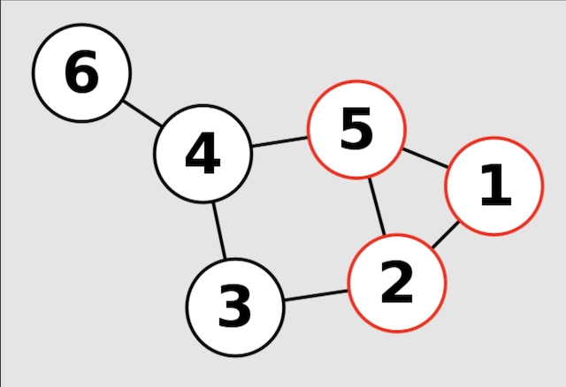

# Problem: Clique

## Description

A **graph**, *G = (V, E)*, is comprised of a set of **vertices** and connections called **edges**.

A **complete** graph is a graph where every vertex is connected by an edge.

Given a graph, *G*, as input, a **clique** is a subgraph that is complete. Two problems related to the notion of a clique are:
* **K-Clique** - Given *G* and an integer *k*, find a clique with *k* vertices.
* **Max Clique** - Given *G*, locate the *largest* clique in the graph.

See the following example for a *3-clique* in a graph of 6 vertices:

From [Wikipedia](https://en.wikipedia.org/wiki/Clique_problem#Definitions)