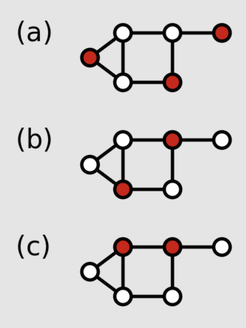

# Problem: Dominating Set

## Description

Given a graph, *G=(V, E)* a *dominating set* of the graph is a set of vertices, *D*, such that each vertex in *D* is either:
* *in* the dominating set or
* *adjacent to* a member of the dominating set.

Particular questions of interest my be about a specific sized dominating set (a **K-Dominating Set** as a generalization) or the **Minimum** Dominating Set.

## Example
Consider:

From [Wikipedia](https://en.wikipedia.org/wiki/Dominating_set).

The above example shows an example graph with a 3-dominating set, and two 2-dominating set. The latter examples are minimal, as there is no 1-dominating set for the graph.

## Related
See also the [vertex cover](https://github.com/joshuaguerin/Answer-Set-Programming-Algorithms/tree/master/Vertex-Cover) problem.

