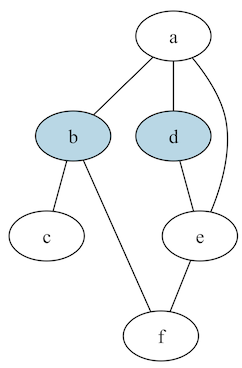

# Dominating Set Printer

## Description
The printer takes input from standard input, and can be piped directly in from the program's output in Clingo.

## Arguments
There is a single, (optional) parameter, `-f f`, where `f` is the file name.

Output generated by Clingo, in this instance, is insufficient for a representative graphic, so the original instance file is supplied (with a path if necessary). If omitted, the parameter defaults to "instance.lp" in the calling directory.

## Sample Output
In this section we explore output generated when max clique is ran using the provided `instance.lp` file.

Output prior to interpretation by graphviz is a `dot` file structure:

```
// Graph visualization using dot
strict graph {
    node [color=black]
    edge [color=black]

    a ; b ; c ; d ; e ; f

    a -- {b ; d ; e};
    b -- {c ; f};
    d -- e;
    e -- f;

    b [style=filled,fillcolor=lightblue];
    d [style=filled,fillcolor=lightblue];
}
```

And the same graph when processed by `dot`:


