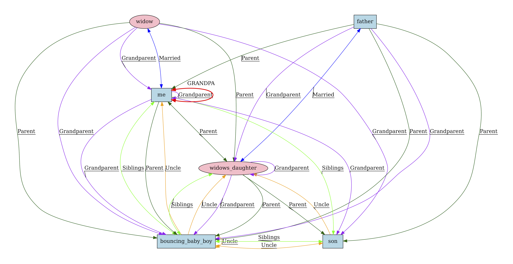

# Problem: I'm my own Grandpa

## Description
"[I'm My Own Grandpa](https://en.wikipedia.org/wiki/I%27m_My_Own_Grandpa)" is a song written by Dwight Latham and Moe Jaffe, and has been performed by several artists including Ray Stevens, Willie Nelson, and Tom Arnold (in the 1996 comedy "The Stupids."). The song is told from the perspective of a narrator who (along with his father) engage in marriages and producting offspring. Through a somewhat convoluted series of inferences, the narrator concludes that, by definition, he has become his own grandfather.

The notion of encoding a family tree is not new, and actually serves as a somewhat common school assignment in logical models and introducing newcomers to logical languages. Indeed, the "I'm my own Grandpa" lyrics have actually inspired discussion of models for representing relationships in family domains, including a chapter of the text "How We Reason" by Philip Johnson-Laird [^1].

[^1]: Johnson-Laird, P. N. (2006). How we reason. Oxford University Press. ISBN 978-0199551330.

## Relationships
The song lyrics [^2] contains only a handful of preexisting relationships, at which point it switches into inference to discover the eventual grandparent relationship between the narrator and himself. These starting relationships are:
* I (the narrator) am married to a widow.
* The widow had an adult daughter with red hear.
* My father marries the widow's daughter.
* I have a son (with the widow), a "bouncing baby boy."
* The widow has a son.

[^2]: Due to existing copyright, the lyrics are not reproduced on this page outside of an analysis of the relationships. At the time of this writing the song lyrics can be found  online in text, audio, and video formats.

Additional relationships that are inferred over the course of the song:
* My father is my son.
* The widow (by marriage to my father) is my daughter and mother.
* The baby is the brother to my father.
* The baby is my uncle.
* The baby is brother of the widow's daughter.
* The son (of the widow's daughter) is my grandchild.
* My wife (widow) is now my grandmother, and I am her grandchild.
* because I am married to the widow (my grandmother) I am my own grandfather.

The following image illustrates the relationships specified directly and inferred from the song:

A larger version of the image can be found in the [images](images/relationships.pdf) directory.

