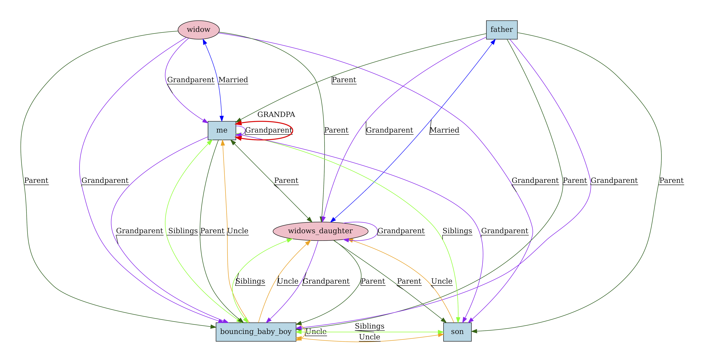

# I am my own Grandpa! Printer

## Description
The printer takes input from standard input, and can be piped directly in from the program's output in Clingo.

### Arguments
There are no arguments, nor configurations necessary.

### Output
Output is in [graphviz](https://graphviz.org/) dot format. The structure should be human-parsable, however use of graphviz will result in improved, visual renderings. Output can be redirected into a `.dot` file or piped directly into the `dot` application.

Please see the printer's header documentation for example use.

## Sample Output
Using the provided `instance.lp` file. Output prior to interpretation by graphviz is a `dot` file structure:


```
// Graph visualization using dot
digraph {
    node [color=black]
    edge [color=black,decorate=true]
    //splines=polyline

    ranksep=2
    { rank=min ; widow ; father; }
    //{ rank=same ; widows_daughter ; me }
    { rank=max ; bouncing_baby_boy ; son }

    me -> widow [dir=both,label="Married",color=blue]
    father -> widows_daughter [dir=both,label="Married",color=blue]
    father -> me [label="Parent",color=darkgreen]
    widow -> widows_daughter [label="Parent",color=darkgreen]
    me -> bouncing_baby_boy [label="Parent",color=darkgreen]
    widows_daughter -> bouncing_baby_boy [label="Parent",color=darkgreen]
    widows_daughter -> son [label="Parent",color=darkgreen]
    father -> son [label="Parent",color=darkgreen]
    father -> bouncing_baby_boy [label="Parent",color=darkgreen]
    widow -> bouncing_baby_boy [label="Parent",color=darkgreen]
    me -> widows_daughter [dir=both,label="Parent",color=darkgreen]
    son -> me [dir=both,label="Siblings",color=green]
    bouncing_baby_boy -> me [dir=both,label="Siblings",color=green]
    bouncing_baby_boy -> widows_daughter [dir=both,label="Siblings",color=green]
    son -> bouncing_baby_boy [dir=both,label="Siblings",color=green]
    me [shape=box,style=filled,fillcolor=lightblue]
    father [shape=box,style=filled,fillcolor=lightblue]
    bouncing_baby_boy [shape=box,style=filled,fillcolor=lightblue]
    son [shape=box,style=filled,fillcolor=lightblue]
    bouncing_baby_boy -> bouncing_baby_boy [label="Uncle",color=orange]
    bouncing_baby_boy -> son [dir=both,label="Uncle",color=orange]
    bouncing_baby_boy -> me [label="Uncle",color=orange]
    bouncing_baby_boy -> widows_daughter [label="Uncle",color=orange]
    son -> widows_daughter [label="Uncle",color=orange]
    father -> bouncing_baby_boy [label="Grandparent",color=purple]
    widows_daughter -> bouncing_baby_boy [label="Grandparent",color=purple]
    widow -> bouncing_baby_boy [label="Grandparent",color=purple]
    me -> bouncing_baby_boy [label="Grandparent",color=purple]
    widow -> son [label="Grandparent",color=purple]
    me -> son [label="Grandparent",color=purple]
    father -> widows_daughter [label="Grandparent",color=purple]
    widows_daughter -> widows_daughter [label="Grandparent",color=purple]
    widow -> me [label="Grandparent",color=purple]
    me -> me [label="Grandparent",color=purple]
    me -> me [dir=both,taillabel="GRANDPA",labeldistance=8,labelangle=1,style=bold,color=red]
    widow [shape=ellipse,style=filled,fillcolor=pink]
    widows_daughter [shape=ellipse,style=filled,fillcolor=pink]
}
```

While this does not lend itself to easy human parsing, when rendered through `dot` we can view the relationships, graphically:


