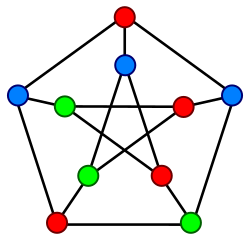
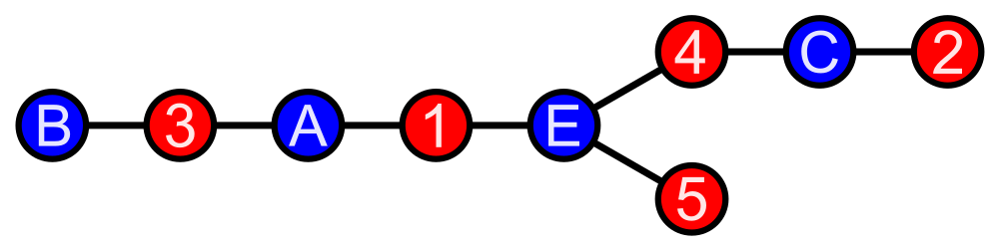
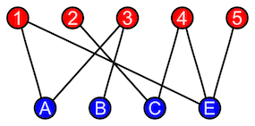

# Problem: Graph Coloring/Colorability

## Description

Given a graph *G=(V, E)*, where *V* is a set of vertices and *E* is a set of edges and a set of colors *C*, find an assignment of colors to vertices such that no two adjacent vertices share an edge.

Two problems related to the *graph coloring* problem are:
* **k-coloring** - Is there a coloring with *k* colors? E.g., 3-colorability.
* **chromatic numbers** - Find the *minimum* number of colors for a given graph.
* **bipartite graph partitioning** - See below under "Problem Variants."

## Example
A graph with 10 vertices and 3 colors.

From [Wikipedia](https://en.wikipedia.org/wiki/Graph_coloring).

## Problem Variants

### Bipartite Graph Partition
A [bipartite graph](https://en.wikipedia.org/wiki/Bipartite_graph) is a graph with nodes that can be partitioned into two sets: *A* and *B*, where every edge connects a vertex in *A* with a vertex in *B*. I.e., No two vertices in either set may be adjacent.

E.g., Consider the graph:

From [Wikipedia](https://en.wikipedia.org/wiki/Bipartite_graph).

The names and colors are assigned to this example graph to identify its biparite nature. The visualization of the partition can be easily created by reconfiguring the vertex layout, guided by colors and names:

From [Wikipedia](https://en.wikipedia.org/wiki/Bipartite_graph).

Note that the bipartite graph above fits the definition of 2-colorability. Indeed, a graph has a bipartite partition if and only if it is 2-colorable (or, equivalently, has a chromatic number of 2 or fewer).[^1]

Because this difference is semantic and not practical, we opt not to provide a separte implementation.

[^1]: Asratian AS, Denley TMJ, Häggkvist R. [Bipartite Graphs and Their Applications.](https://archive.org/details/bipartitegraphst0000asra/page/n3/mode/2up?view=theater&ui=embed&wrapper=false) Cambridge University Press; 1998.
