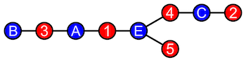

# Problem: Graph Coloring/Colorability

## Description

Given a graph *G=(V, E)*, where *V* is a set of vertices and *E* is a set of edges and a set of colors *C*, find an assignment of colors to vertices such that no two adjacent vertices share an edge.

Two problems related to the *graph coloring* problem are:
* **k-coloring** - Is there a coloring with *k* colors? E.g., 3-colorability.
* **chromatic numbers** - Find the *minimum* number of colors for a given graph.
* **bipartite graph partitioning** - See below under "Problem Variants."

## Example
A graph with 10 vertices and 3 colors.

From [Wikipedia](https://en.wikipedia.org/wiki/Graph_coloring).

## Problem Variants

### Bipartite Graph Partition
A [bipartite graph](https://en.wikipedia.org/wiki/Bipartite_graph) is a graph with nodes that can be partitioned into two sets: *A* and *B*, where every edge connects a vertex in *A* with a vertex in *B*. I.e., No two vertices in either set may be adjacent.

E.g., Consider the simple graph:

From [Wikipedia](https://en.wikipedia.org/wiki/Bipartite_graph).

The names and colors are assigned to this example graph to identify its biparite nature. The visualization of the partition can be easily created by reconfiguring the vertex layout:

From [Wikipedia](https://en.wikipedia.org/wiki/Bipartite_graph).

