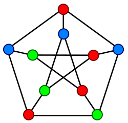

# Problem: Graph Coloring/Colorability

## Description

Given a graph *G=(V, E)*, where *V* is a set of vertices and *E* is a set of edges and a set of colors *C*, find an assignment of colors to vertices such that no two adjacent vertices share an edge.

Two problems related to the *graph coloring* problem are:
* **k-coloring** - Is there a coloring with *k* colors. (E.g., 3-colorability).
* **chromatic numbers** - Find the *minimum* number of colors for a given graph.

## Example
A graph with 10 vertices and 3 colors.

From [Wikipedia](https://en.wikipedia.org/wiki/Graph_coloring).
