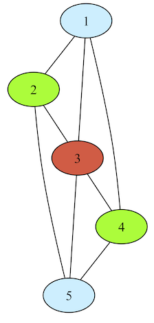

# Colorability Printer

## Description
The printer takes input from standard input, and can be piped directly in from the program's output in Clingo.

## Arguments
There are no arguments, nor configurations necessary.

## Sample Output
In this section we explore output generated when graph coloring is ran using the provided `instance.lp` file.

Output prior to interpretation by graphviz is a `dot` file structure:

```
// Graph visualization using dot
strict graph {
    node [color=black]
    edge [color=black]

    1 ; 2 ; 3 ; 4 ; 5

    1 -- {2 ; 3 ; 4};
    2 -- {3 ; 5};
    3 -- {4 ; 5};
    4 -- 5;

    1 [style=filled,fillcolor=lightblue1];
    5 [style=filled,fillcolor=lightblue1];
    3 [style=filled,fillcolor=tomato2];
    2 [style=filled,fillcolor=lawngreen];
    4 [style=filled,fillcolor=lawngreen];

} // Coloring Number: 3
```

And the same graph when processed by `dot`:




## Implementational Details

In order to differentiate node "colors," we use the available colors in graphviz. We have provided a list of 15 sample colors by default--this can easily be modified by the user if a different palette is desired.

