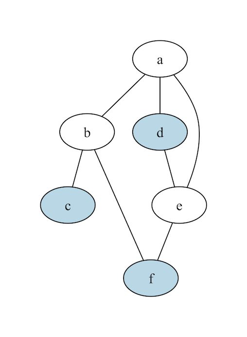

# Problem: Independent Set

## Description

Given a graph *G=(V, E)*, and **independent set** (or **anticlique**) of the graph is a subset of vertices, *I*, such that no vertices in *I* are adjacent. Related problems are either finding an independed set of a particular size (a **K-Independent Set**), or the related optimization problem, finding the *maximal* independent set.

By definition and independent set is the *opposite* of a [clique](https://github.com/joshuaguerin/Answer-Set-Programming-Algorithms/tree/master/Clique) in a graph.

## Example

From [Wikipedia](https://en.wikipedia.org/wiki/Independent_set_(graph_theory)).

In the above graph the *blue* vertices indicate a maximal independent set in the graph.

## Related Problems
See also the [Clique](https://github.com/joshuaguerin/Answer-Set-Programming-Algorithms/tree/master/Clique) problem.