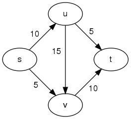

# Problem: Max Flow

## Description

Let *G=(V, E)* be a directed graph. **Network  flow** problems annotate edges with maximum capacities: *e = (a, b, c)*, where the capacity, *c*, defines the maximum amount of "flow" over *e* from *a* to *b*. (Think: moving water or electricity, packages in transit, railways, etc.)

The **Max Flow** problem is a network flow optimization problem where the following restrictions must be met:
* there are dedicated start and terminal nodes,
* flow over an edge may not exceed its capacity,
* for any internal (not start or terminal) node, total incoming flow must equal total outgoing flow,
* and we wish to *maximize* flow through the network from the start to the terminal node.

## Example

Consider the simple flow network:

From [Wikipedia](https://en.wikipedia.org/wiki/Maximum_flow_problem#Definition).

We wish to maximize flow from *s* to *t*, while adhering to the above rules. This can be accomplished in the following manner:
* *(s, t)* and *(s, v)* receive full capacity of 10 and 5, respectively.
* *(u, v)* has its flow reduced below capacity to 5.
* *(u, t)* and *(v, t)* now can operate at capacities of 5 and 10, respectively.

The key to this particular solution is the reduction in flow for *(u, v)*.
* This reduces *u*'s remaining output to the optimal 5.
* This increases *v*'s input to the optimal 10.
