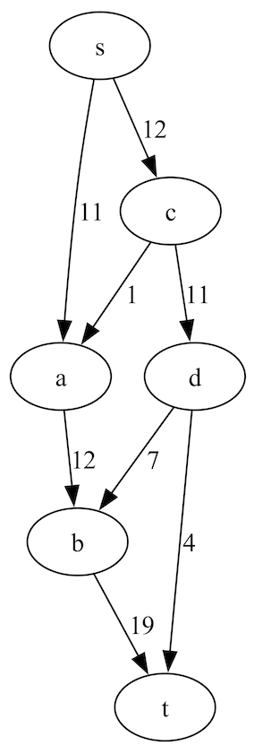

# Max Flow Printer

## Description
The printer takes input from standard input, and can be piped directly in from the program's output in Clingo.

### Arguments
There are no arguments, nor configurations necessary.

## Output

In this section we explore output generated when graph coloring is ran using the provided `instance.lp` file.

Output prior to interpretation by graphviz is a `dot` file structure:


```
// Graph visualization using dot
strict digraph {
    node [color=black]
    edge [color=black,dir=none]

    s ; t ; a ; b ; c ; d

    s -> a [label="11"];     s -> c [label="11"];
    a -> b [label="12"];
    c -> a [label="1"];     c -> d [label="1"];
    b -> t [label="19"];
    d -> b [label="7"];     d -> t [label="7"];

    subgraph cluster_0 {
        style=invis

        d -> t [dir=yes,label="4"];
        b -> t [dir=yes,label="19"];
        c -> a [dir=yes,label="1"];
        s -> a [dir=yes,label="11"];
        d -> b [dir=yes,label="7"];
        a -> b [dir=yes,label="12"];
        s -> c [dir=yes,label="12"];
        c -> d [dir=yes,label="11"];

    }
}
```

And the same graph when processed by `dot`:



