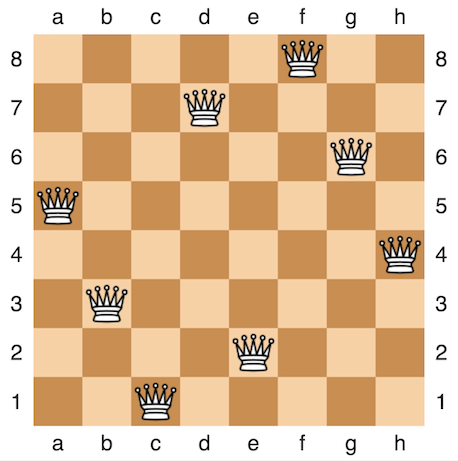

# Problem: N-Queens

## Description
The **N-Queens** problem is a puzzle based on the attack pattern of a **queen** in chess. Given an integer parameter *n*, we need to find an assignment of *n* queens on an *n*x*n* chessboard where no two queens are able to attack.

Since a **queen** may attack any number of positions in any direction, we can induce the following rules:
* No two queens may occupy the same *row*.
* No two queens may occupy the same *column*.
* No two queens may occupy the same *diagonal*.

E.g.,

The following is a solution to the 8-Queens problem:

From [Wikipedia](https://en.wikipedia.org/wiki/Eight_queens_puzzle)