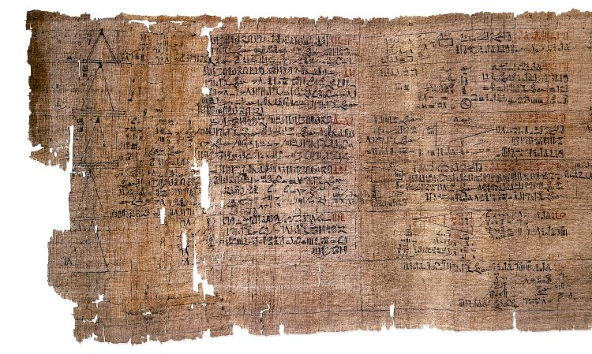

# Problem: Prime Sieve

## Description

A number, *n*, is **prime** if *n* has no integer divisors other than 1 and itself.
* The first five **prime** numbers are: {2, 3, 5, 7, 11}.

A number, *n*, is **composite** if *n* has integer divisors other than 1 and itself.
* The first five **composite** numbers are: {4, 6, 8, 9, 10}.

These categories are clearly mutually exclusive, and one can be defined by the other.

A **sieve** is an algorithm or program that computes **primes**, typically in a range given as input.

Rhind Papyrus image from [Wikipedia](https://en.wikipedia.org/wiki/Rhind_Mathematical_Papyrus) expressin different forms of primes/composites.