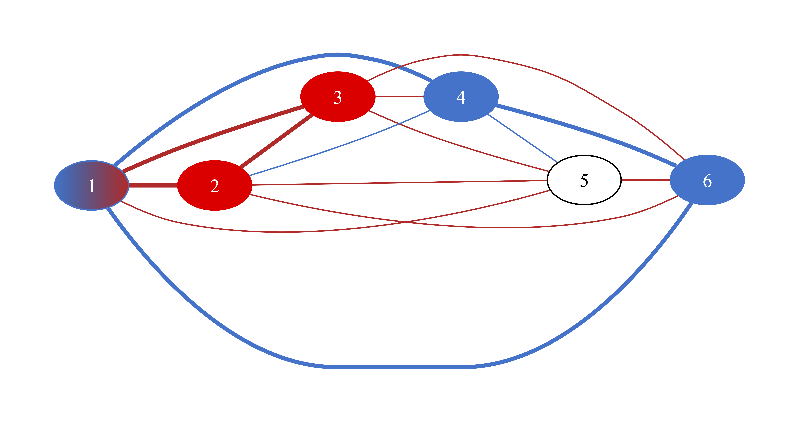

# Problem: Ramsey Graphs

## Description

A **graph**, *G = (V, E)*, is comprised of a set of **vertices** and connections called **edges**.

A complete graph on *n* vertices, *Kn* is a graph where all vertices are connected by an edge.

Given a graph, *G*, as input, a **clique** is a subgraph that is complete.

While searching for a [clique](https://github.com/joshuaguerin/Answer-Set-Programming-Algorithms/tree/master/Clique) in a given graph is a common phrasing of the clique problem, Ramsey graphs are related to [Ramsey's theorem](https://en.wikipedia.org/wiki/Ramsey%27s_theorem):

Given a complete graph on and two colors, **r**ed and **b**lue, there exists a least positive integer *R(r, b)* for which every coloring contains either a *red* clique of size **r** or a blue clique of size **s**.

We define the Ramsey Graph problem (in [ramsey_graph.lp](https://github.com/joshuaguerin/Answer-Set-Programming-Algorithms/blob/ramsey-numbers/Ramsey-Graphs/ramsey_graph.lp)) as the problem of searching for a positive instance of a graph, given parameters of *k*, *r*, and *b*.

## Example
The following example is searching for a graph where **k=6**, **r=3**, and **b=3**.

Note that node 5 would also satisfy being in the red clique, however the implementation looks to match arguments for *r* and *b* exactly.

## Dependencies
The [print](print/) system generates [graphviz](https://graphviz.org/) files for input, that can be viewed, redirected into a file, or rendered using dot. The latter step can be omitted if graphviz is not present or if graphical output is not desired. 

## Related
See also:
* [clique](https://github.com/joshuaguerin/Answer-Set-Programming-Algorithms/tree/master/Clique) 
