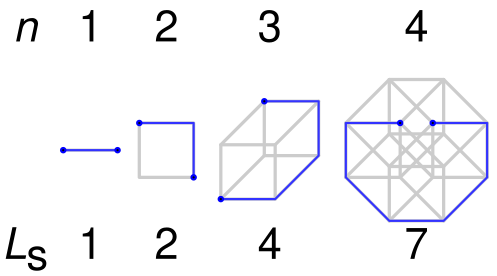

# Problem: Snake in the Box

## Description
The **Snake in the Box** problem is a graph problem which asks what is the
longest path in an *n*-dimensional **hypercube** graph where no two
non-consecutive vertices in the path share an edge.

A *n*-dimensional hypercube graph is a graph where each vertex can be labeled
with a unique bit string that is *n* bits long and an edge exists between two
vertices iff their bit strings differ on a single bit.

## Example

The following are solution for *n* = 1, 2, 3, and 4

From [Wikipedia](https://en.wikipedia.org/wiki/Snake-in-the-box)
