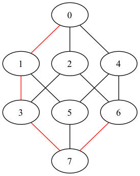

# Snake in the Box Printer

## Description
The printer takes input from standard input, and can be piped directly in from the program's output in Clingo.

## Arguments
There are no arguments, nor configurations necessary.

## Sample Output
In this section we explore output generated when **n**=3.

Output prior to interpretation by graphviz is a `dot` file structure:

```
// Graph visualization via dot.
graph H {
	node [color=black];
	edge [color=black];
	0 -- 1 [color="red"];
	0 -- 2;
	0 -- 4;
	1 -- 3 [color="red"];
	1 -- 5;
	2 -- 3;
	2 -- 6;
	3 -- 7 [color="red"];
	4 -- 5;
	4 -- 6;
	5 -- 7;
	6 -- 7 [color="red"];
}
// Path length: 4
```

And the same graph when processed by `dot`:


