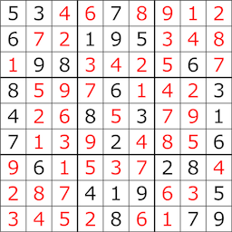

# Problem: Sudoku

## Description
A standard Sudoku puzzle is a 9x9 grid, further divided into 9 3x3 subgrids. The rules of Sudoku are as follows:
1. Available numbers are: 1..9.
1. Each cell holds a single number.
2. Each row holds exactly one of each number.
3. Each column holds exactly one of each number.
4. Each of the subgrids holds exactly one of each number.

## Example
The starting puzzle configuration has a portion of the cells blank, with others holding starting values:

Source: [Wikipdedia](https://en.wikipedia.org/wiki/Sudoku)

The goal is to fill each cell with numbers that adhere to the Sudoku rules, thereby completing the puzzle.

Source: [Wikipdedia](https://en.wikipedia.org/wiki/Sudoku)

## Generalization
While this implementation is for the most common, 9x9 variant, sudoku can be generalized to multiple grid sizes that would share the similar properties. E.g., 4x4, 9x9, 16x16, 25x25, etc.
