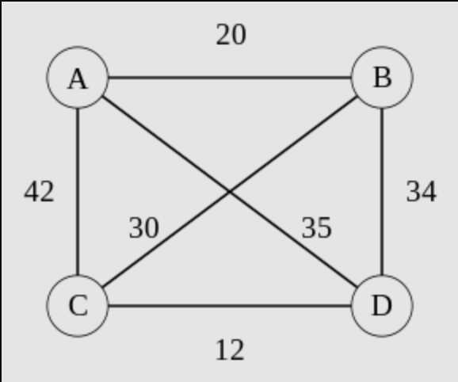

# Problem: Travelling Salesman Problem

## Description
Given a graph, *G=(V, E)* and a start and end vertex, *s* and *e*, a **path** in a graph is a finite sequence of edges from *s* to *e*.

A **path** is **Hamiltonian** if all vertices *V* occur *exactly once* in the path.

A **Hamiltonian Path** is a solution to the **Travelling Salesman** Problem if it is the *smallest* such path.

E.g.,

From: [Wikipedia](https://en.wikipedia.org/wiki/Travelling_salesman_problem#Description)

In the above graph, one of many Hamiltonian paths from *a* to *d* is:
* a -> c -> b -> d, at a path length of 106.

However, only one such path is a solution to the Travelling salesman problem:
* a -> b -> c -> d, with a minimal path length of 62.
