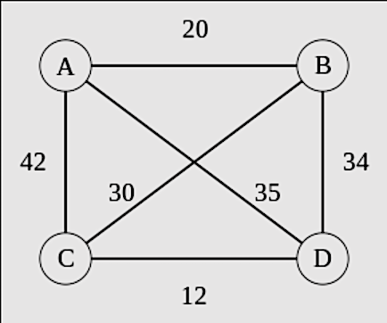

# Problem: Travelling Salesman Problem

## Description
Given a graph, *G=(V, E)* and a start and end vertex, *s* and *e*, a **path** in a graph is a finite sequence of edges from *s* to *e*.

A **path** is **Hamiltonian** if all vertices *V* occur *exactly once* in the path.

A **Hamiltonian Path** is a solution to the **Travelling Salesman** Problem if it is the *smallest* such path.

## Example

From: [Wikipedia](https://en.wikipedia.org/wiki/Travelling_salesman_problem#Description)

In the above graph, one of many Hamiltonian paths from *a* to *d* is:
* a -> c -> b -> d, at a path length of 106.

However, only one such path is a solution to the Travelling salesman problem:
* a -> b -> c -> d, with a minimal path length of 62.

Note that due to the similarities between the two algorithms, the implementations may be nearly identical.
* Only an additional minimization constraint is required to go from one to the other.

## Implementational Details

The reader may recognize that the cost, `C`, in the `edge` and `path` predicates is unused. Indeed, this extra information serves no purpose in our Hamiltonian path implementation. I.e., The user could easily remove it from the implementation and instance files and everything should still work. The third parameter is maintaned across both HAMPATH and TSP solutions, allowing for the same instance file to work across both implementations.

## Problem Variants
Both the Hamiltonian Path problem and The Travelling Salesman Problem are phrased above in terms of paths, with distinct start and end points, *s* and *e*. Both problems can be phrased as both a *path* or a *cycle*. The latter is reformulated in terms of a single point that servers as *both* start and end. I.e., the cycle formulation starts and ends at the same location.

Because the computational complexity of the problem is the same irrespective of whether it is phrased as a path or cycle, the *path* problem formulation has been selected for consistency in these examples.
