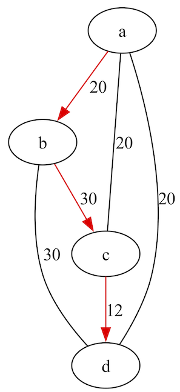

# Hamiltonian Path/Travelling Salesman Readme

## Description
The printer takes input from standard input, and can be piped directly in from the program's output in Clingo.

### Arguments
There is a single, (optional) parameter, `-f f`, where `f` is the file name.

Output generated by Clingo, in this instance, is insufficient for a representative graphic, so the original instance file is supplied (with a path if necessary). If omitted, the parameter defaults to "instance.lp" in the calling directory.

### Output
In this section we explore output generated when graph coloring is ran using the provided `instance.lp` file using the TSP implementation.

Output prior to interpretation by graphviz is a `dot` file structure:
```
// Graph visualization using dot
strict digraph {
    node [color=black]
    edge [color=black,dir=none]

    a ; b ; c ; d
    a -> b [label="20"];     a -> c [label="20"];     a -> d [label="20"];
    b -> c [label="30"];     b -> d [label="30"];
    c -> d [label="12"];

    subgraph cluster_0 {
        style=invis

        a -> b [color=red,dir=yes,label="20"];
        b -> c [color=red,dir=yes,label="30"];
        c -> d [color=red,dir=yes,label="12"];

    }
}
```

And the same graph when processed by `dot`:



