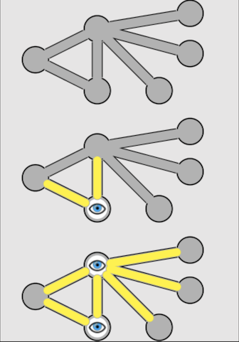

# Problem: Vertex Cover

## Description

Given a graph, *G=(V, E)*, a **vertex cover** is a subset of vertices, *C*, such that each edge has an endpoint in *C*. Related questions are whether there is a vertex cover of size *k* (a **K-Vertex Cover**) or the optimization problem of finding the *minimal* vertex cover.

E.g., Consider the illustration:

From [Wikipedia.](https://en.wikipedia.org/wiki/Vertex_cover).

The first image above is an representation of a graph. The final image represents the vertex cover, with vertices in the cover being able to "see" the entire graph.

## Related
See also the [dominating set](https://github.com/joshuaguerin/Answer-Set-Programming-Algorithms/tree/master/Dominating-Set) problem.
