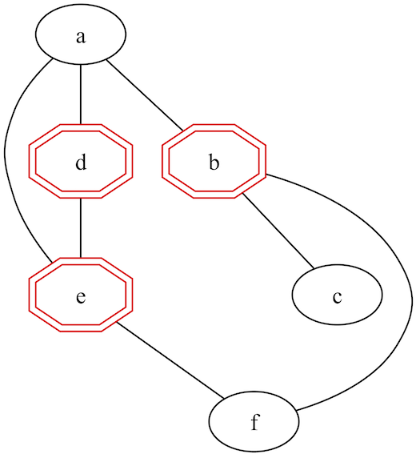

# Vertex Cover Printer

## Description
The printer takes input from standard input, and can be piped directly in from the program's output in Clingo.

### Arguments
There are no arguments, nor configurations necessary.

### Output
In this section we explore output generated when graph coloring is ran using the provided `instance.lp` file using the minimum cover implementation.

Output prior to interpretation by graphviz is a `dot` file structure:
```
// Graph visualization using dot
strict graph {
    node [color=black]
    edge [color=black]

    a b c d e f

    a -- {b ; d ; e}
    b -- {c ; f}
    d -- e
    e -- f

    subgraph cluster_0 {
        style=invis

        b [color=red,shape=doubleoctagon]
        d [color=red,shape=doubleoctagon]
        e [color=red,shape=doubleoctagon]

    }
}
```

And the same graph when processed by `dot`:



